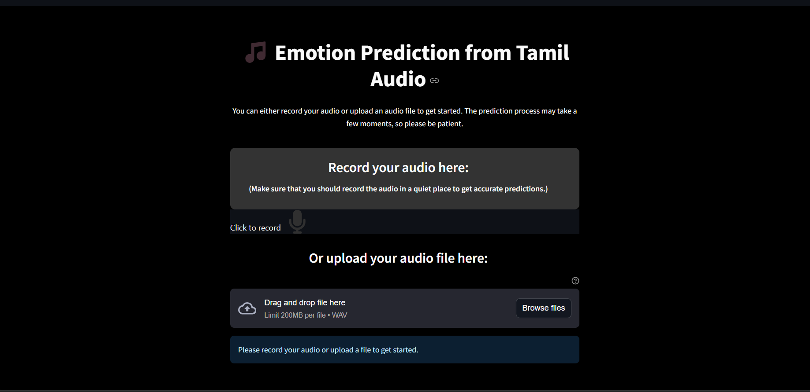

# Emotion Prediction from Tamil Audio 🎵

https://tamil-audio-emotion-prediction.streamlit.app/

[]

This project is a Streamlit web application that predicts emotions from Tamil audio recordings. Users can either record their audio directly on the web app or upload an audio file for emotion prediction. The app uses a pre-trained TensorFlow model to classify the audio into one of five emotions: Angry, Fear, Happy, Neutral, or Sad.

## Table of Contents
- [Features](#features)
- [Installation](#installation)
- [Usage](#usage)

## Features
- Record audio directly within the app.
- Upload audio files in `.wav` format.
- Predicts one of five emotions from Tamil audio: Angry, Fear, Happy, Neutral, or Sad.
- User-friendly interface with custom styling.
- Real-time prediction feedback.

## Installation

1. **Clone the repository:**
   ```bash
   git clone https://github.com/yourusername/emotion-prediction-tamil-audio.git
   cd emotion-prediction-tamil-audio
2. **Create and activate a virtual environment (optional but recommended):**
    ```bash
    python -m venv env
    source env/bin/activate  # On Windows use `env\Scripts\activate`
3. **Install the required dependencies:**
    ```bash
    pip install -r requirements.txt
    How to Run
4. **Start the Streamlit application:**
    ```bash
    streamlit run app.py
5. **Access the application:**
   - Once the server starts, you can access the app in your web browser at http://localhost:8501.

## Usage
**Record Audio:**

- Navigate to the recording section of the app.
- Click the "Record" button to start recording your voice.
- Click the "Stop" button once you're done.

**Upload Audio:**

- Scroll down to the file upload section.
- Upload a .wav file by dragging it into the uploader or clicking to browse.

**Predict Emotion:**

- After recording or uploading, click the "Predict Emotion" button.
- The predicted emotion will be displayed after a few moments.
